

  

 

  A collection of all my Lua scripts for <a href="https://github.com/YimMenu/YimMenuV2">YimMenuV2</a> bundled together in a working submenu.

#

> [!IMPORTANT]
> TinkerScripts is officially available only in [this repository](https://github.com/lmagineNothing/TinkerScripts) and the following sites:
>
> - [Unknowncheats](https://www.unknowncheats.me/forum/grand-theft-auto-v/772902-tinkerscripts-yimmenuv2.html)
> - [Codeberg](https://codeberg.org/ImagineNothing/TinkerScripts)
>
> Downloading from other sources may result in getting an outdated version of this script or even malware.  
> (Always check that the file extension is **.lua** | see TinkerScripts structure below).

  <H3>TinkerScripts is only compatible with Enhanced<H3>
  

 

  
<B>How To Use</B>

  

  
<B>Structure</B>

<pre><code>
TinkerScripts.lua ← This is the main script.
📦 TinkerScripts/ ← This is the folder that contains the necessary files for the main script to work.
├─ 📄 Blips.lua
├─ 📂 HumanCanvas/
│  ├─ 📄 Exported_TattooCombo.txt ← Using "Export/Import Tattoos" will save to/load from this file.
│  └─ 📄 FMCharTats.lua
├─ 📂 Settings/
│  ├─ 📂 BlockCloudSaves/
│  │  ├─ 📄 BlockCloudSaves.bat ← See BlockCloudSaves
│  │  └─ 📄 NoSave.txt
│  └─ 📄 TS_Settings.lua
└─ 📂 TS_RecoveryPlus/
   ├─ 📄 Tunables.lua
   └─ 📄 Unlocks.lua
</code></pre>
Tree generated with File Tree Extractor.

## Loading The Script
  1) Download TinkerScripts.zip from [Releases](https://github.com/lmagineNothing/TinkerScripts/releases/latest) and extract it.
  2) Place both TinkerScripts.lua and TinkerScripts (folder) into: `%AppData%/YimMenuV2/scripts`
  3) Open YimMenuV2, go to Settings → Lua Scripts and click TinkerScripts.lua.
  

## [Block Cloud Saves](docs/BlockCloudSaves.md)

  
<B>Categories & Features</B>

#### Main
- General
    - Fast Respawn.
    - Fast Reload.
    - Infinite Combat Roll. (+ No Recoil/Spread)
    - Ragdoll on command.
    - Character abilities boost.
    - Force Cloud Save.
    - Teleport into Personal Vehicle.
    - Teleport into Closest Vehicle.
- Auto-Drive
    - Driving Style.
    - Auto-Drive to Waypoint.
    - Auto-Wander.

- Re-Name Editor
    - Rename your **Outfit** and **Businesses** with symbols and colors.

- Misc
    - Rapid Oxidation: Embrace **The Spirit Of Vengeance** and **The Phoenix**.
    - TinyPlayer: Become **Ant-Man**. (I guess?)
    - No Clip Animations and State On-Screen.
    - Hidden Locations: Teleport to Hidden/Random Locations.

#### Biz-Teroids
- Business on steroids! Resupply and Restock your businesses with a single click! (or choose your own options).
    - Instant Sell/Buy/Steal.
    - Trigger Excess Weapon Parts & Bar Earnings.

#### Phone Master
- Phone Animations.
- Remote Snapmatic.
- Contact Override: ONLY STRIPPERS AVAILABLE (Overrides Lester).
- SP Themes & Sound sets.
- Background & Color scheme.
- Celltowa Model.
- Phone Orientation & Position.

#### Gun Van Halen
- An actual Gun Van editor. (no more typing weapon ids).

#### Rainbow Vehicles
- Like the pony, but on wheels.

#### Recovery +
- A category with useful/convenient stats and _some_ **UNLOCKS** .
If you want to unlock **EVERYTHING**, check out this other script: [UnlockEverything](https://www.unknowncheats.me/forum/4743916-post792.html)

    - Safe Cracker: Heist Finale Options. *Only those that are NOT available in the menu, except the Kortz Center Heist (See screenshot below, I can't explain this part properly)
    - Extras:
        - Mission Skips. *Only those that can't be replayed through the Pause Menu
        - Misc:
            - Enable Heists Weekly Boost.
            - Criminal Mastermind Bonus. ($12M Bonus)
            - Casino Heist: P.O.I & Extras (Secure Keypad & Vault Door) Reset.
            - Crack Stash House Safe. Removed at some point but added it back since built-in one doesn't automatically open the safe
    - Loot Auto-Grab
    - Unlocks:
        - Content Unlocks: All Bunker, Collectibles, Tattoos, LSC Unlocks. (probably won't add more)
        - Character Stats: Fast Run, Frozen Rank, Max out stats.
    - Money:
        - Good Behaviour Bonus, Casino Membership Bonus.
        - Sindy Looper: MC Clubhouse Bag-Loop. THESE FEATURES SHOULD NOT BE CONSIDERED "SAFE". I haven't tested the limits.
    - Tunables: Enable Independence Day and Christmas content. (probably won't add more)
    - Human Canvas:
        - Stack, Import and Export Tattoos.
        - Stack Face Paints.
        - Hair Colors: Regular and Hidden Hair/Highlight Colors.

#### Settings +
- Save/Load submenu settings.
- Block Cloud Saves.

  
<B>Screenshots</B>

  

<table>
    <tr>
      <td align="center">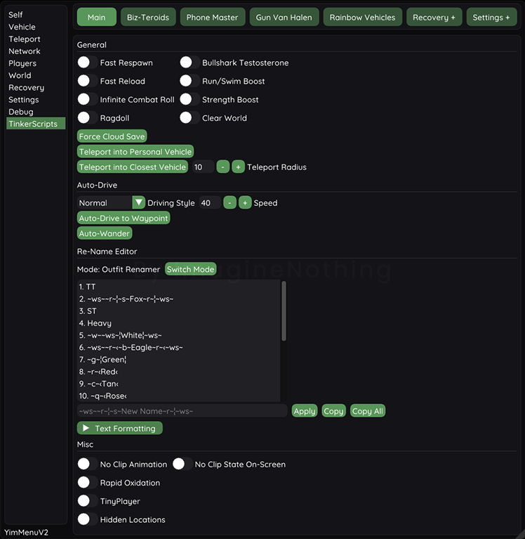 Main</td>
      <td align="center">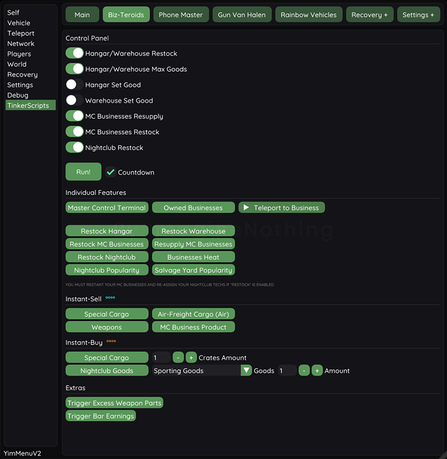 Biz-teroids</td>
      <td align="center">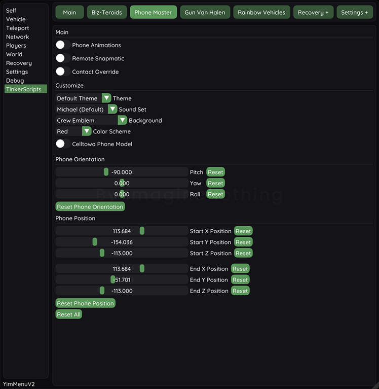 Phone Master</td>
      <td align="center">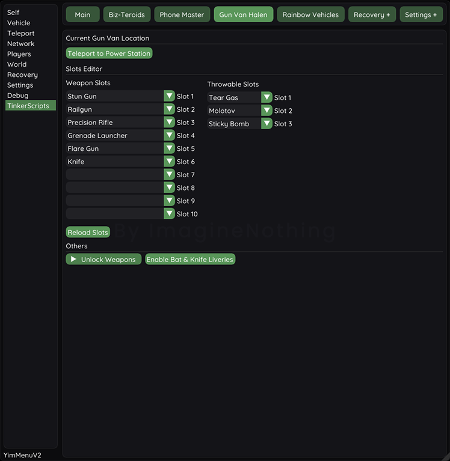 Gun Van Halen</td>
      <td align="center">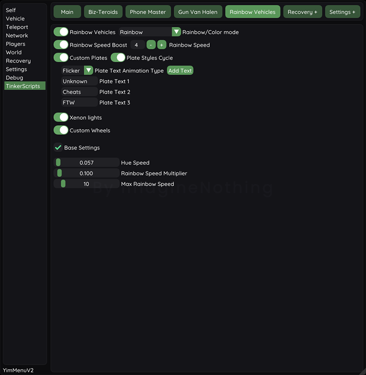 Rainbow Vehicles</td>
    </tr>
    <tr>
      <td align="center">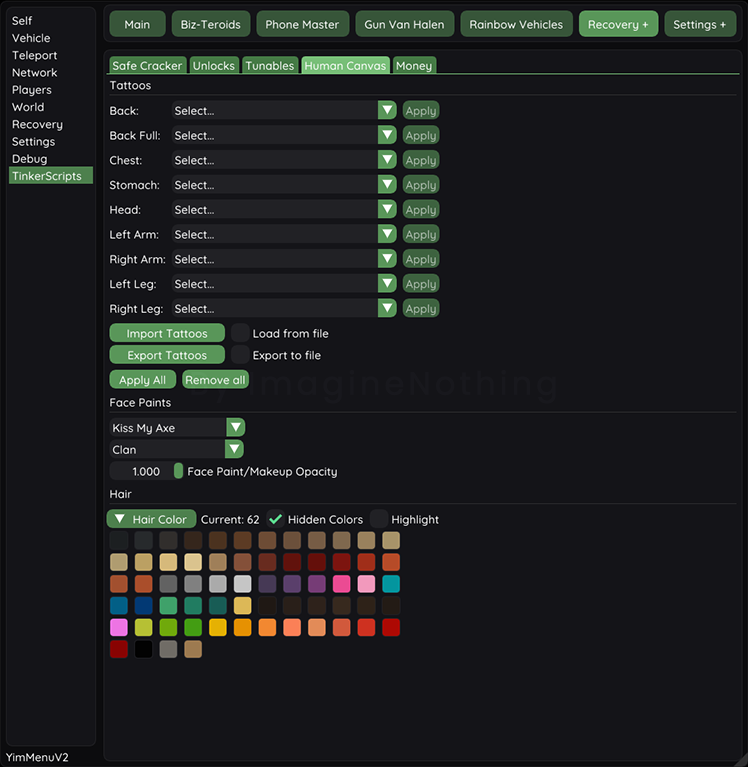 Recovery + (HumanCanvas)</td>
      <td align="center">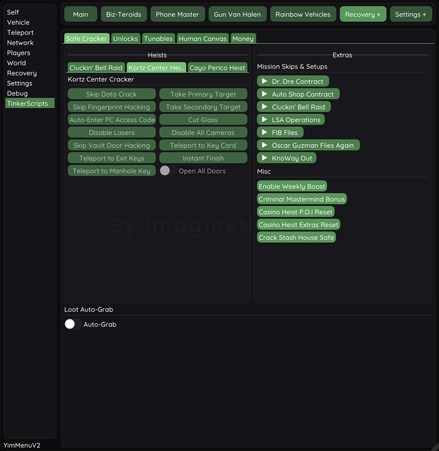 Recovery + (Safe Cracker)</td>
      <td align="center">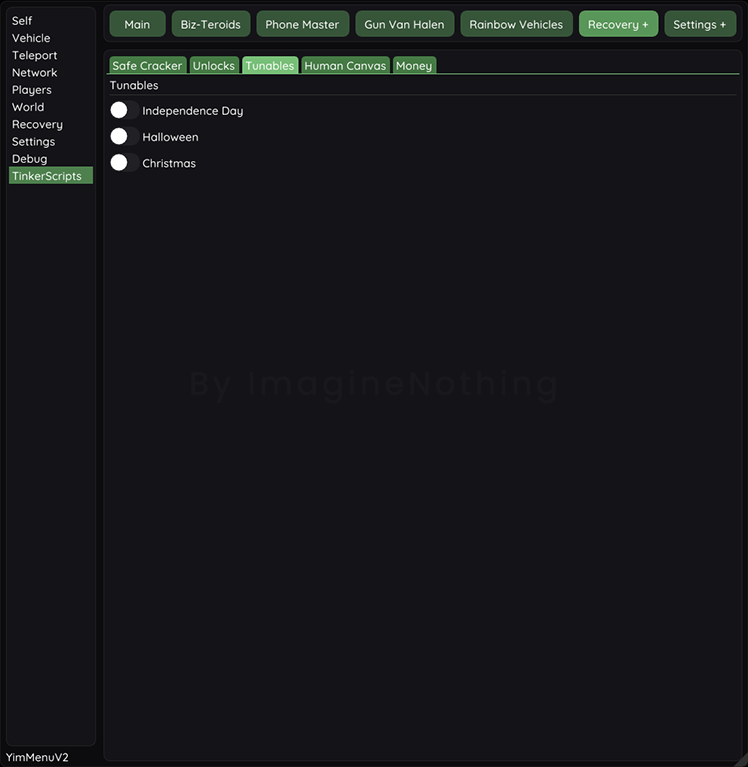 Recovery + (Tunables)</td>
      <td align="center">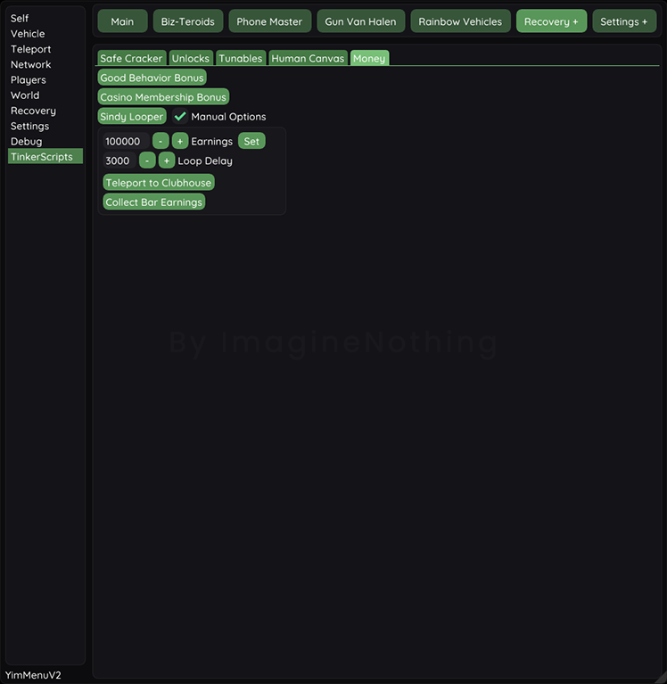 Recovery + (Money)</td>
      <td align="center">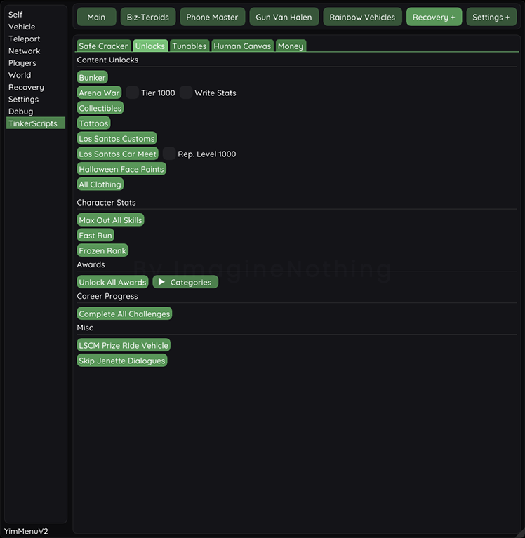 Recovery + (Unlocks)</td>
    </tr>
    <tr>
      <td align="center">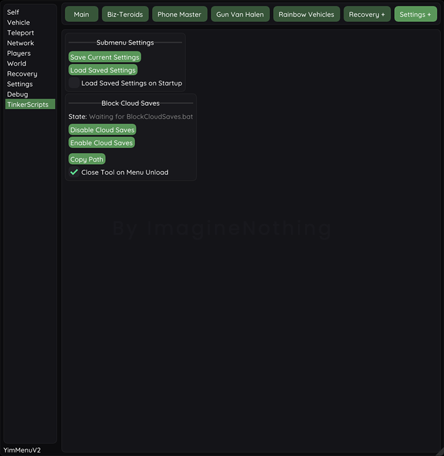 Settings +</td>
    </tr>
  </table>

  
<B>Note</B>

  
_
This submenu shouldn't be considered an example of how things should be done.
_ <!-- No way this works lol -->

- The next update will probably be just organizing stuff. I feel more confident now, so it shouldn't be _THAT_ hard.
- Money tab and various unlocks weren't planned from the beginning; added them just because, but I don't consider them an essential part of this submenu.
- Added a few more features after taking the screenshots above.

Also, I've tested every single feature mentioned above, but you still may find the following issues (not necessarily because of the script, but because of how the game works):

- Game will freeze for a brief moment when TinkerScripts is selected after submenu loads for the first time in session (game session, not freemode) because of the Outfit Renamer.
- Phone Master: Works well but it breaks a bit when using the email app. Enabling Celltowa phone model breaks some services, e.g. Clothing Stores or the Gun Van; can be fixed by joining a new session. If phone gets stuck completely you'll have to restart the game (It has happened to me only once, and was just after latest patch 1158.16)
- Human Canvas: Stacked Face Paints are not persistent and will disappear after restarting the game.
- Open All Doors in Cayo Perico Heist won't enable loot in Compound. Use Solo Mantrap to be able to grab the loot.

## RESPECT THE CODE

I'm not a programmer. I even struggle with the basics, but I'm proud of what I've done so far.

  
<B>However</B>

  I've felt discouraged since some skids have beem stealing my scripts. This has made me consider not releasing this submenu (good or bad) at all, but there is no turning back now that I've made this repo public...
  
  So, (for those "I'vE bEeN pRoGrAmMiNg fOr A dEcAdE" skids) I'll just say that moving things around, and adding your name to someone else's work to make people think you are the author is called plagiarism.
  
  Is it that hard to give proper credit and provide the source?

You're not obfuscating anything by doing a simple operation on large numbers btw.

If you have made changes to the original code or you are using it in your own menu (or YimMenuV2 fork) and you really want to **SHARE**, **don't discriminate**; keep it **open source** for **EVERYONE**.

Also, **stop feeding my mess to AI** .-.

# Contact
<a href="https://www.unknowncheats.me/forum/private.php?do=newpm&u=3627117">Direct Link to PM</a>

`No, I don't use Discord.`

# Credits
- [Mystro69](https://github.com/Mystro69) | [Outfit Renamer](https://github.com/Mystro69/Outfit-Renamer-1.66)
- [ShinyWasabi](https://github.com/ShinyWasabi) | [scrDbg](https://github.com/ShinyWasabi/scrDbg)
- [xesdoog](https://github.com/xesdoog) | [YimRageUI](https://github.com/xesdoog/YimRageUI) - Helped me better understand how to interact with an UI/submenu.
- Stack Overflow | Code Snippets & Information <!-- A LOT -->